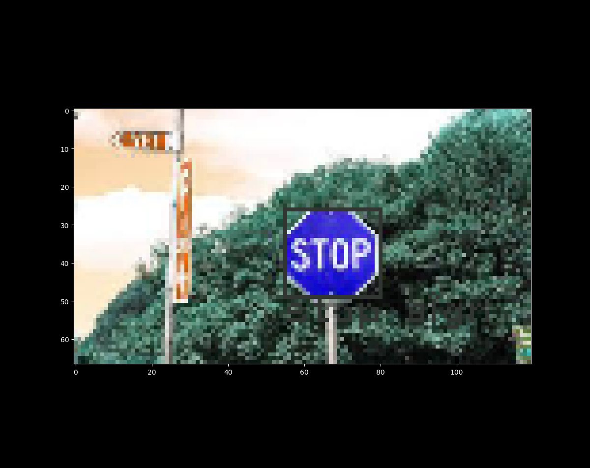
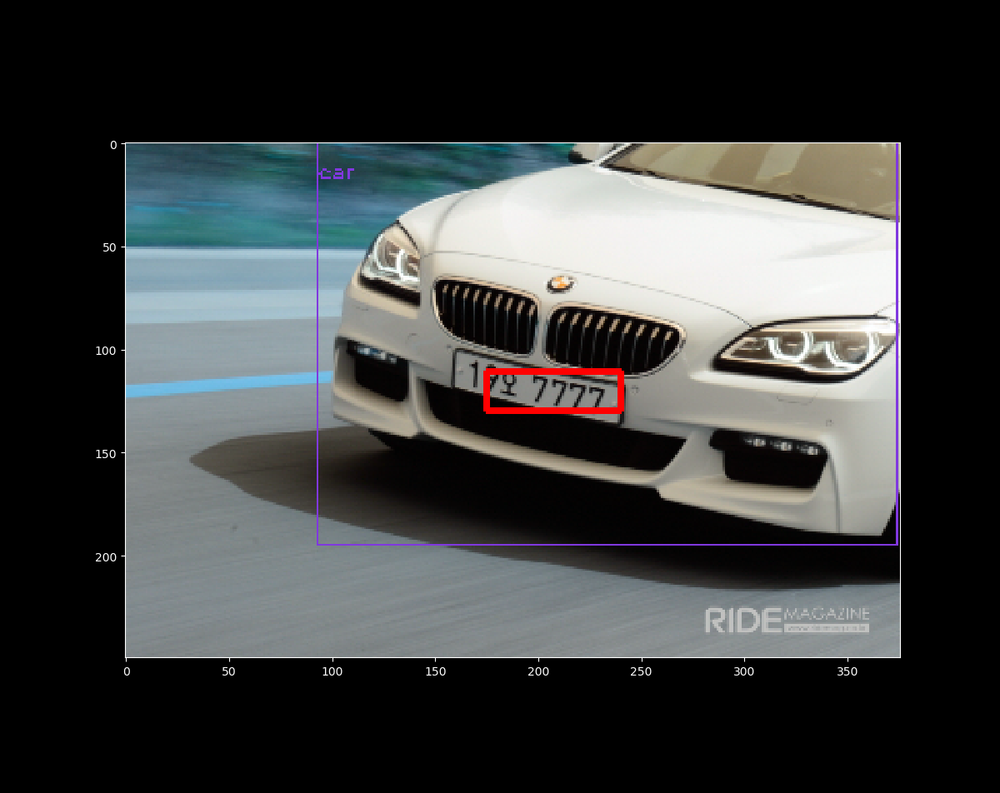

# YOLOV3-OPENCV-PYTESSORACT
This is example of using OpenCV dnn for YOLOV3 and pytessoract for car license
  
when the car is not inside of picture  
  
when the car is inside of picture  

if you choice absent or wrong name image you will get resize error

reference:  
https://pysource.com/2019/06/27/yolo-object-detection-using-opencv-with-python/  
https://github.com/kairess  
https://github.com/the-house-of-black-and-white/opencv-dnn-demo/issues/1  
